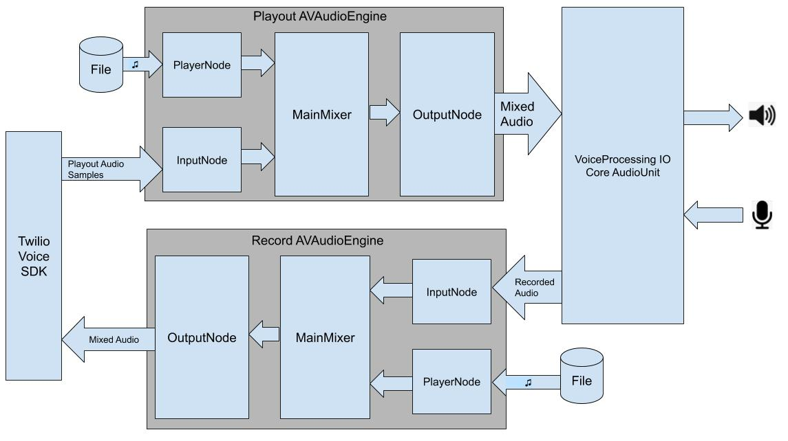
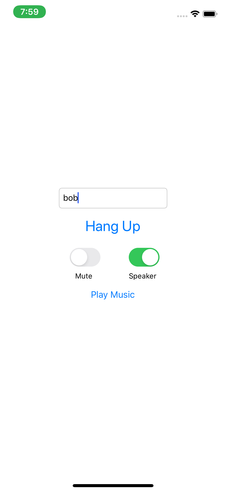

# Twilio Voice TVOAudioDevice Example

The project demonstrates how to use Twilio's Programmable Voice SDK with audio playback and recording functionality provided by a custom `TVOAudioDevice`.

The example demonstrates the custom audio device **ExampleAVAudioEngineDevice**, which uses CoreAudio's VoiceProcessingIO audio unit to playback and record audio at up to 48KHz with built-in echo cancellation. The example uses two AVAudioEngine in manual rendering mode:

1. The upstream AVAudioEngine is used for mixing the Remote Participant's audio with audio from a file. The AudioUnit receives mixed audio samples from AVAudioEngine's output node.
2. The downstream AVAudioEngine is used for mixing the Local Participant's microphone audio with audio from a file. The Voice SDK receives the mixed audio samples from the AVAudioEngine's output node.

This diagram describes how ExampleAVAudioEngineDevice uses TwilioVoice, AVAudioEngine, and CoreAudio -

Please note, ExampleAVAudioEngineDevice requires iOS 11.0 or above.

### Setup

See the master [README](https://github.com/twilio/voice-quickstart-ios/blob/master/README.md) for instructions on how to generate access tokens and make an outbound Call.

This example requires Xcode 11.0 and the iOS 12.0 SDK, as well as a device running iOS 11.0 or above.

### Running

Once you have configured your access token, build and run the example. Use the text field to make an outgoing call:

<kbd></kbd>

Once the Call is connected, tap the "Play Music" button and let ExampleAVAudioEngineDevice mix some tunes into your track.

<kbd></kbd>

### Known Issues

The AVAudioSession is configured and activated at device initialization time. Ideally, it would be better to activate the AVAudioSession only when audio playback or recording is needed.