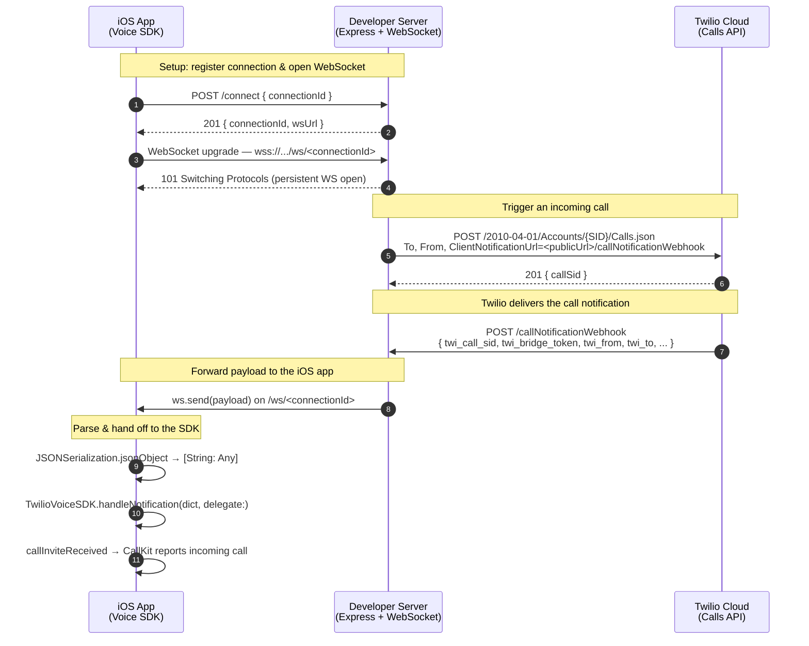

### Client Notification Webhook Example

This example shows how to leverage the Twilio [Client Notification Webhook feature](https://www.twilio.com/docs/voice/sdks/client-call-notification-webhook) and manage your own client instances and notification delivery. 

In this example, a websocket connection will be used to deliver the incoming call notification to the app. Developers can choose the best channel for their application use case, for example delivering the incoming call notification via push notifications to optimize reachability and battery management.

#### How this works

- A websocket connection is established between the application developer's server and the iOS app.
- A webhook URL is provided as the `ClientNotificationUrl` parameter to the Twilio Call Resource API.
- The incoming call notification is delivered to the server.
- The server sends the message to the iOS app via the websocket connection.
- The iOS app passes the payload to the TwilioVoiceSDK.handleNotification() method and handle the call invite.



#### Run the example

1. Install dependencies for the websocket server

```
cd servers/websocket-server
npm install
```

2. Start the server

```
cd servers/websocket-server
NGROK_AUTHTOKEN=$NGROK_AUTHTOKEN TWILIO_ACCOUNT_SID=$TWILIO_ACCOUNT_SID TWILIO_AUTH_TOKEN=$TWILIO_AUTH_TOKEN node server.js
```

Note that the node.js server uses [Ngrok](https://ngrok.com/) to create the tunnel and public URL for the app to access the local server. Create one or use the auth token of your account to run the server.

Once started, you should see the public URL to your local server in the console logging

```
WebSocket server listening on port 3000
[ngrok] tunnel established: https://********.ngrok.app
```

3. Update the access token, websocket server URL and client identity placeholders in `ClientNotificationWebhookExample/ViewController.swift` then run the app

```swift
let accessToken = "eyJh..."
let websocketServerURL = URL(string: "https://********.ngrok.app")
let clientIdentity = "bob"
```

The app will connect to the `/connect` endpoint of the local server and the following message indicates the connection is established successfully

```
[connection bob] slot created, WebSocket URL: wss://********.ngrok.app/ws/bob
[connection bob] WebSocket client connected
```

4. Hit the `/triggerIncomingCall` endpoint to trigger a call to the iOS app

```
curl --location 'https://********.ngrok.app/triggerIncomingCall' \
--header 'Content-Type: application/json' \
--data '{
    "connectionId": "bob",
    "to": "client:bob",
    "from": "client:alice"
}'
```

The `/triggerIncomingCall` endpoint specifies `https://********.ngrok.app/callNotificationWebhook` as value of the `ClientNotificationUrl` parameter so Twilio will deliver the call notification to the `/callNotificationWebhook` endpoint.

5. The notification payload is sent to the `/callNotificationWebhook` endpoint and sent to the iOS app. Parse the JSON string into **NSDictionary** format and use the `TwilioVoiceSDK.handleNotification()` method to kick off the incoming call invite display.
