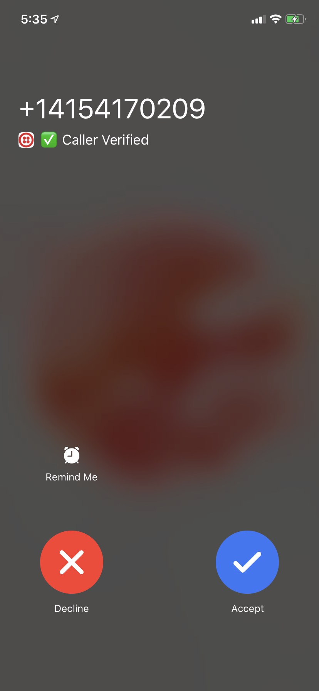
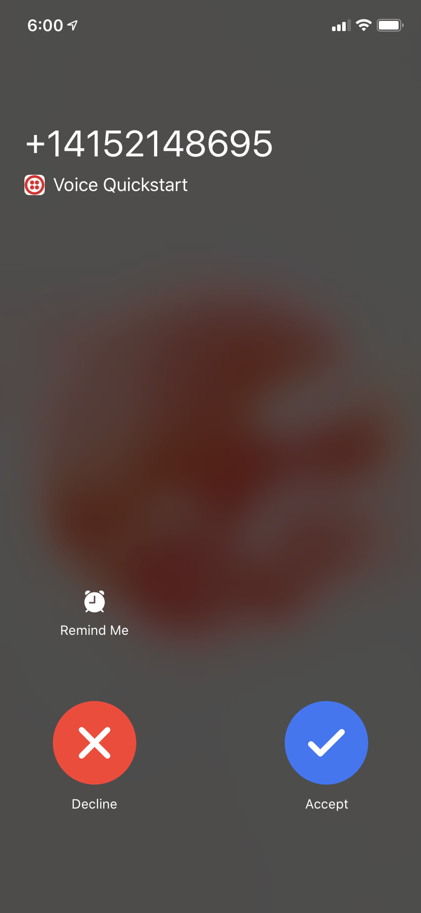

# Display verified caller number using TVOCallerInfo

The [TVOCallerInfo](https://twilio.github.io/twilio-voice-ios/docs/latest/Classes/TVOCallerInfo.html) provides information about the caller. The `verified` property represents whether or not the caller's phone number has been verified by Twilio using **SHAKEN/STIR** validation.

Use the information and display in the CallKit incoming call UI upon receiving the call invite

```.swift
func callInviteReceived(_ callInvite: TVOCallInvite) {
    var callKitProviderName = "Voice Quickstart\n"
    let callerInfo: TVOCallerInfo = callInvite.callerInfo
    if let verified: NSNumber = callerInfo.verified {
        if verified.boolValue {
            callKitProviderName = "✅ Caller Verified\n"
        }
    }

    let configuration = CXProviderConfiguration(localizedName: callKitProviderName)
    configuration.maximumCallGroups = 1
    configuration.maximumCallsPerCallGroup = 1

    callKitProvider = CXProvider(configuration: configuration)
    callKitProvider.setDelegate(self, queue: nil)

    // Report to CallKit
    let callHandle = CXHandle(type: .generic, value: callInvite.from)
    let callUpdate = CXCallUpdate()
    callUpdate.remoteHandle = callHandle

    callKitProvider.reportNewIncomingCall(with: uuid, update: callUpdate) { error in
        if let error = error {
            NSLog("Failed to report incoming call successfully: \(error.localizedDescription).")
        } else {
            NSLog("Incoming call successfully reported.")
        }
    }    
}
```

* Please note that the designated initializer `[CXProviderConfiguration initWithLocalizedName:]` has been deprecated on iOS 14.

If the number of the caller is verified

<kbd></kbd>

If the number is not validated at **A** level or there is no verification information

<kbd></kbd>
