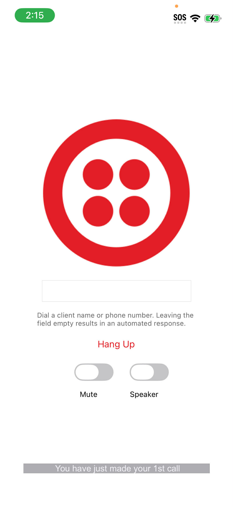

# Twilio Voice Speech Transcriber Example

This project demonstrates how to access and feed the audio buffer of the remote audio track to the `SpeechTranscriber` for speech recognition using the `Speech` framework.

**Note**: The iOS `SpeechTranscriber` class requires iOS 26.

For more detail, check out the WWDC 2025 session [Bring advanced speech-to-text to your app with SpeechAnalyzer](https://developer.apple.com/videos/play/wwdc2025/277) or download the SpeechAnalyzer samplep code [here](https://developer.apple.com/documentation/speech/bringing-advanced-speech-to-text-capabilities-to-your-app). 

<kbd></kbd>